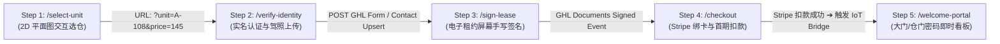

# 04 — StoreGuard AI 5 步自助选仓与签约漏斗实操搭建全指南

> **漏斗名称**：`StoreGuard — 24/7 Smart Move-In Funnel`  
> **目标**：实现租客从「手机选仓」到「实名签约」、「绑卡支付」与「密码立得」的 **100% 全自动无人化移动端闭环**（全流程平均仅需 1.5 ~ 2 分钟）。

---

## 漏斗 5 步数据流与状态机全景图



---

## GHL 后台逐步创建指南 (Click-by-Click SOP)

### 准备工作：新建漏斗
1. 打开 GHL 后台，左侧导航进入 **`Sites ➔ Funnels`**；
2. 点击右上角 **`+ New Funnel`**，输入名称：`StoreGuard — 24/7 Smart Move-In Funnel`；
3. 依次点击 **`+ Add New Step`** 创建以下 5 个页面步骤。

---

### Step 1: 交互选仓页 (`/select-unit`)
* **页面路径 (Path)**: `/select-unit`
* **模板源码**: [`snapshot/funnel_pages/step1_select_unit.html`](file:///Users/peifengni/storeguard-ai/snapshot/funnel_pages/step1_select_unit.html)
* **GHL 搭建方式**:
  1. 在 GHL 页面编辑器中，拖入一个 **Full Width Section**；
  2. 拖入 **Custom Code / HTML JS** 元素；
  3. 粘贴 `snapshot/04_FLOORPLAN_WIDGET_CODE.html` 的全部代码（或直接使用 `step1_select_unit.html`）；
  4. **参数流转核心逻辑**：当租客在 SVG 平面图上点击某个空仓（例如 `A-108`），页面自动触发带参数跳转：
     ```javascript
     window.location.href = '/verify-identity?unit=A-108&size=10x10%20Climate&price=145';
     ```

---

### Step 2: 租客实名核身与证件上传 (`/verify-identity`)
* **页面路径 (Path)**: `/verify-identity`
* **模板源码**: [`snapshot/funnel_pages/step2_verify_identity.html`](file:///Users/peifengni/storeguard-ai/snapshot/funnel_pages/step2_verify_identity.html)
* **核心组件配置**:
  * **选仓信息摘要条**：顶部动态显示已选仓号（`Unit A-108 | $145/mo`）；
  * **GHL Form 控件**：
    * `First Name` / `Last Name` (必填)
    * `Phone` (必填，关键唯一凭证，用于下发大门密码短信)
    * `Email` (必填，用于发送电子收据与合同)
    * `File Upload` (证件照片 ➔ 绑定字段 `id_document_url`)
    * `Emergency Contact` (姓名与电话)
    * **隐藏字段 (Hidden Fields)**：添加 `unit_number`, `unit_size`, `monthly_rent`，设置默认抓取 URL Query Parameter；
  * **提交后动作 (Redirect Action)**：跳转至下一页 `/sign-lease`。

---

### Step 3: 电子租约手写签署 (`/sign-lease`)
* **页面路径 (Path)**: `/sign-lease`
* **模板源码**: [`snapshot/funnel_pages/step3_sign_lease.html`](file:///Users/peifengni/storeguard-ai/snapshot/funnel_pages/step3_sign_lease.html)
* **GHL 搭建方式**:
  * **方式 A (推荐)**：使用 GHL **Documents & Contracts** 元素，直接调用前面部署的 [`05_LEASE_AGREEMENT_TEMPLATE.md`](file:///Users/peifengni/storeguard-ai/snapshot/05_LEASE_AGREEMENT_TEMPLATE.md)，合同内自动替换租客姓名与仓号；
  * **方式 B**：直接使用 `step3_sign_lease.html` 内置的 **HTML5 Canvas 手机手写签名板**，租客用手指直接在屏幕签名，勾选条款后点击前进至 `/checkout`。

---

### Step 4: 绑卡结算与首期扣款 (`/checkout`)
* **页面路径 (Path)**: `/checkout`
* **模板源码**: [`snapshot/funnel_pages/step4_checkout.html`](file:///Users/peifengni/storeguard-ai/snapshot/funnel_pages/step4_checkout.html)
* **GHL 2-Step Order Form 产品挂载**:
  在 GHL 漏斗设置中的 **`Products`** 选项卡，关联我们在系统中已创建的产品：
  1. **主产品 (Recurring)**：`10x10 Climate Controlled Unit` ($145.00/月)
  2. **必选附加产品 (One-Time)**：`Security Deposit (Refundable)` ($100.00)
  3. **Order Bump 增值项 (Recurring)**：`Tenant Protection Insurance ($5,000)` (+$15.00/月，默认勾选)
* **底层支付**: 启用 Stripe Elements，支持 Visa / MasterCard / Apple Pay / Google Pay；
* **支付成功联动**:
  * Stripe 扣款成功 $\rightarrow$ GHL 触发 **WF-1: Move-In Provisioning** 工作流；
  * 工作流向 `StoreGuard IoT Bridge` 发送 Webhook 生成门锁动态密码；
  * 页面瞬间跳转至 Step 5。

---

### Step 5: 入住成功与密码看板 (`/welcome-portal`)
* **页面路径 (Path)**: `/welcome-portal`
* **模板源码**: [`snapshot/funnel_pages/step5_welcome_portal.html`](file:///Users/peifengni/storeguard-ai/snapshot/funnel_pages/step5_welcome_portal.html)
* **核心内容展示**:
  * 🎉 **入住确认祝贺横幅**
  * 🔑 **大门动态进出码**（例如 `6250#`）
  * 🔒 **独立仓门 6 位智能锁 PIN**（例如 `958431#`）
  * 📍 **园区地址与 Google Maps 导航按钮**
  * 💡 **智能防遗忘提示**：“如遗忘密码，随时向官方号码回复【CODE】即可 1 秒秒回！”

---

## 🛠️ 预览与测试

本地所有 5 个页面的纯前端静态 HTML 源码均保存在：
👉 **[`/Users/peifengni/storeguard-ai/snapshot/funnel_pages/`](file:///Users/peifengni/storeguard-ai/snapshot/funnel_pages/)**

你可以在浏览器中直接打开 `step1_select_unit.html`，体验从选仓点击、输入实名、手写签名、模拟支付到最终展示大门密码的全流程动画与交互！
